# 系统架构图文档

## 1. 整体系统架构

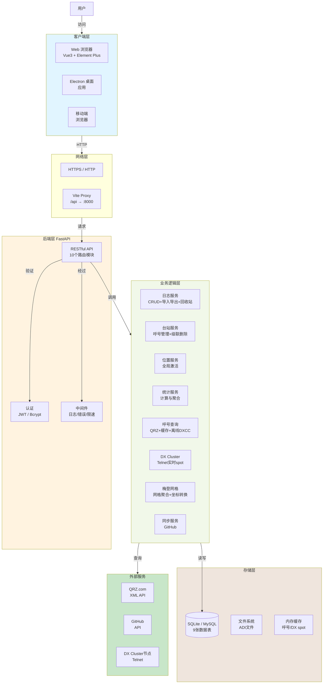

## 2. 三层部署架构

### 2.1 纯本地部署（SQLite）

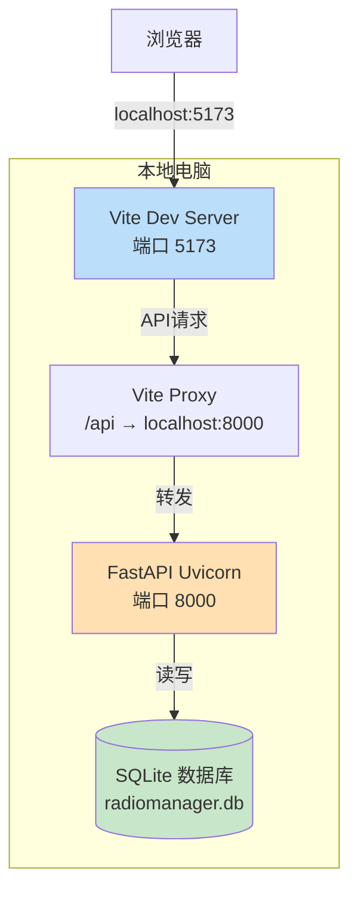

### 2.2 局域网部署（Docker + MySQL）

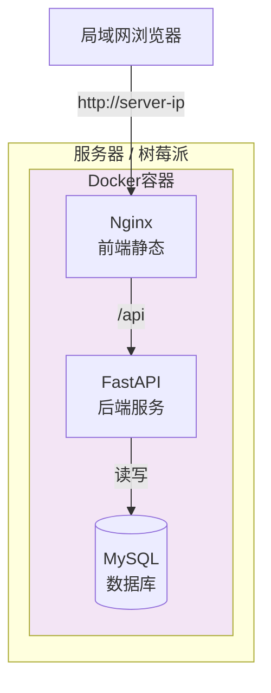

### 2.3 云服务器部署

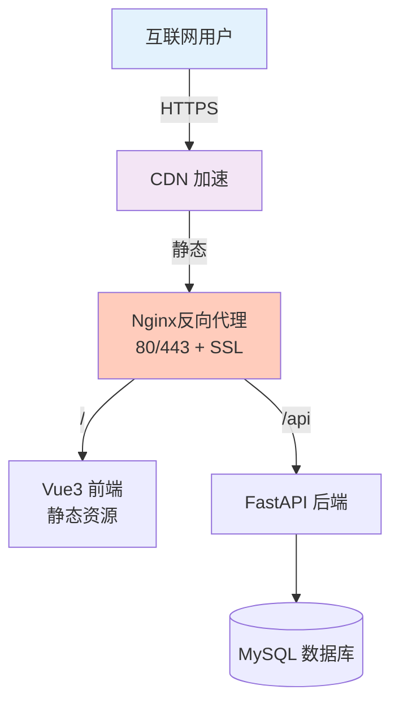

## 3. 前端架构

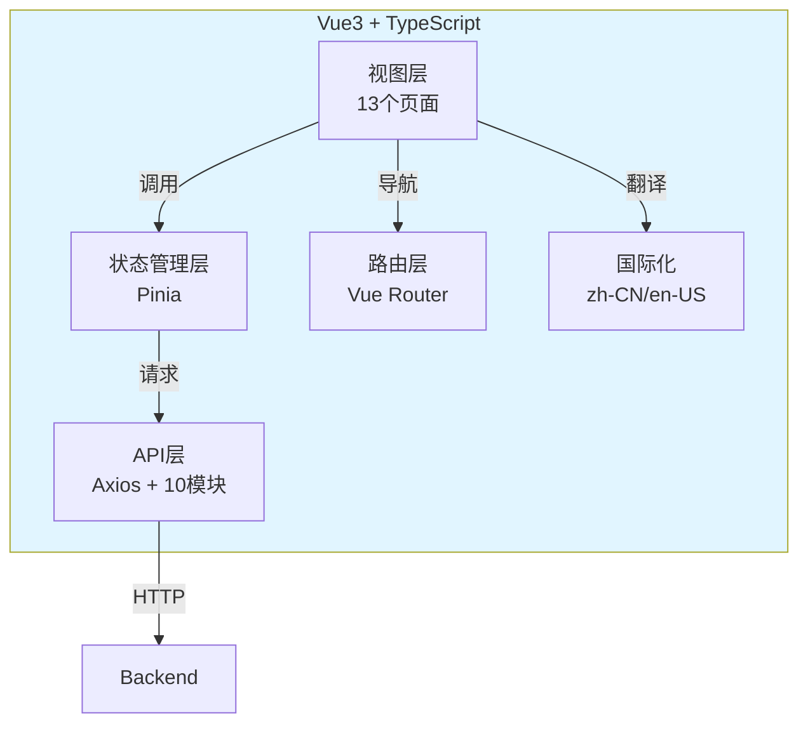

## 4. 后端架构

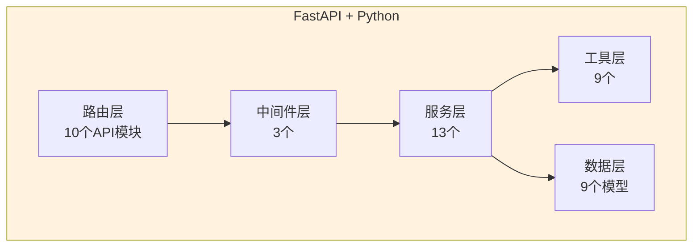

## 5. 数据库架构

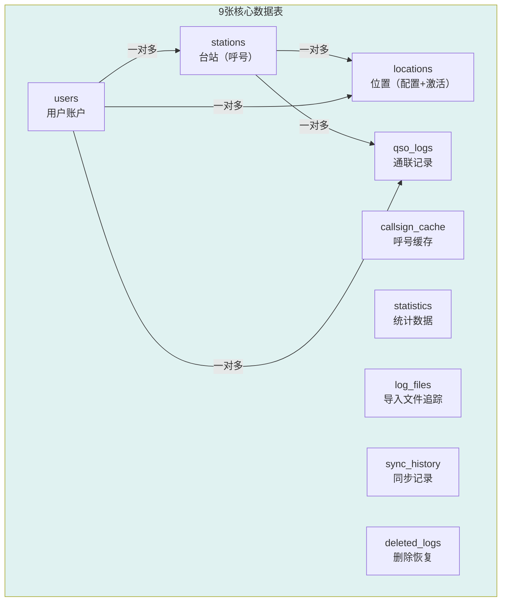

## 6. 台站-位置-日志关系

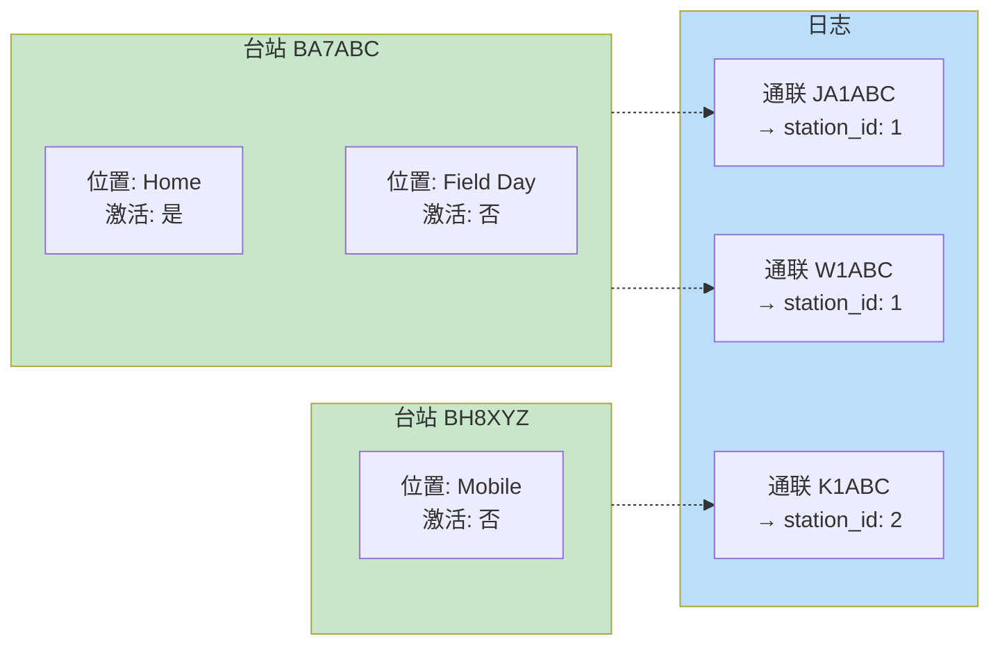

## 7. 位置激活流程

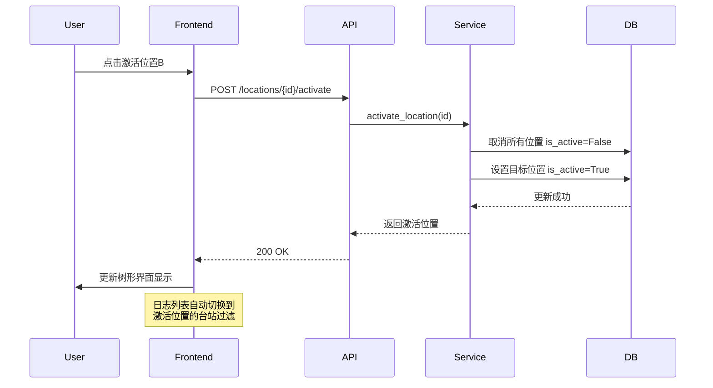

## 8. 日志导入导出流程

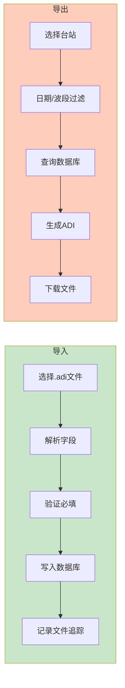

## 9. 认证授权流程

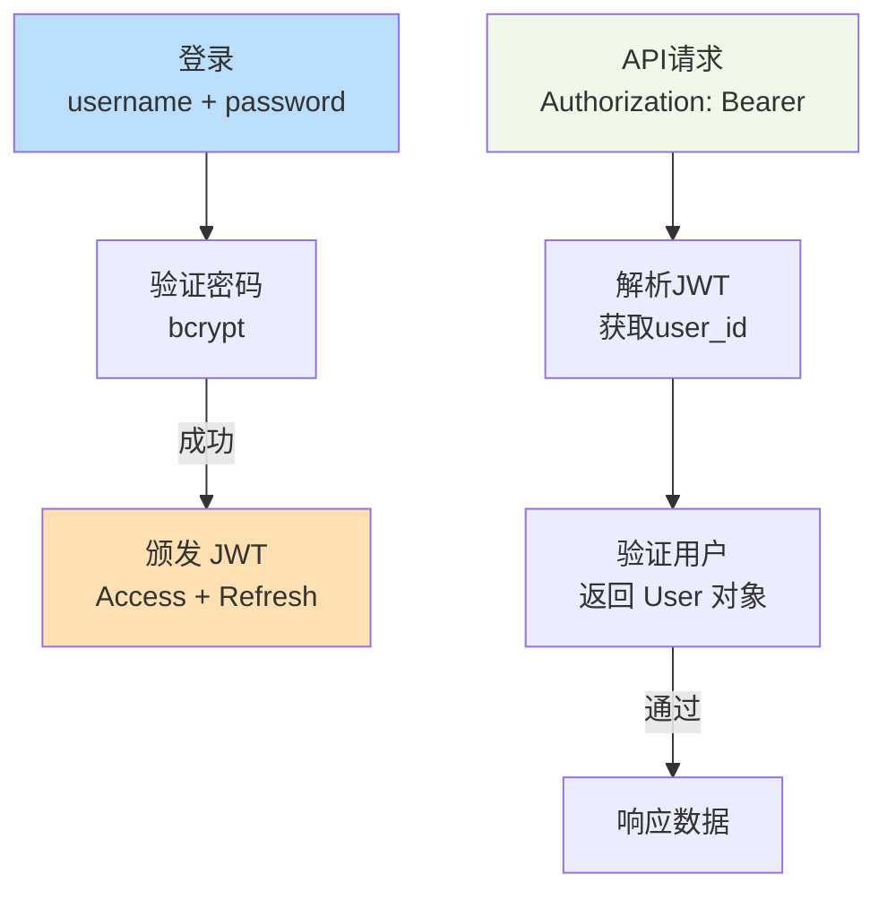

## 10. 仪表板时钟与统计

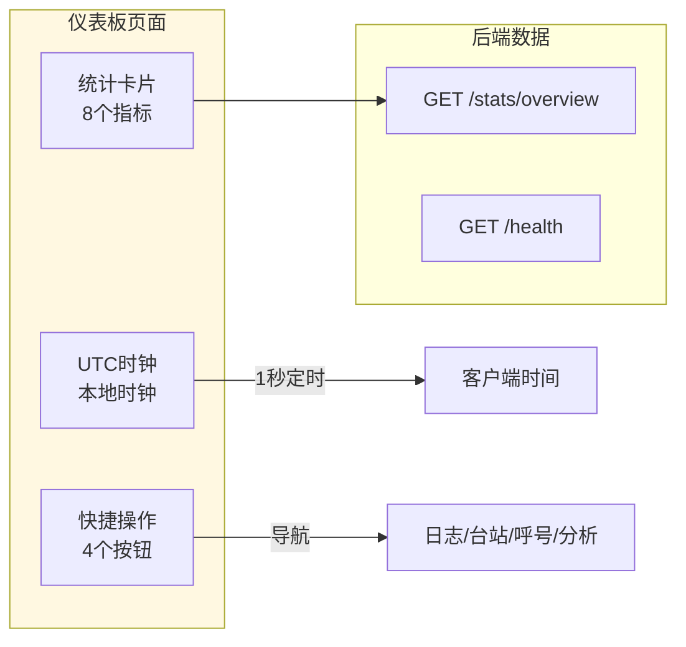

## 11. 时区同步流程

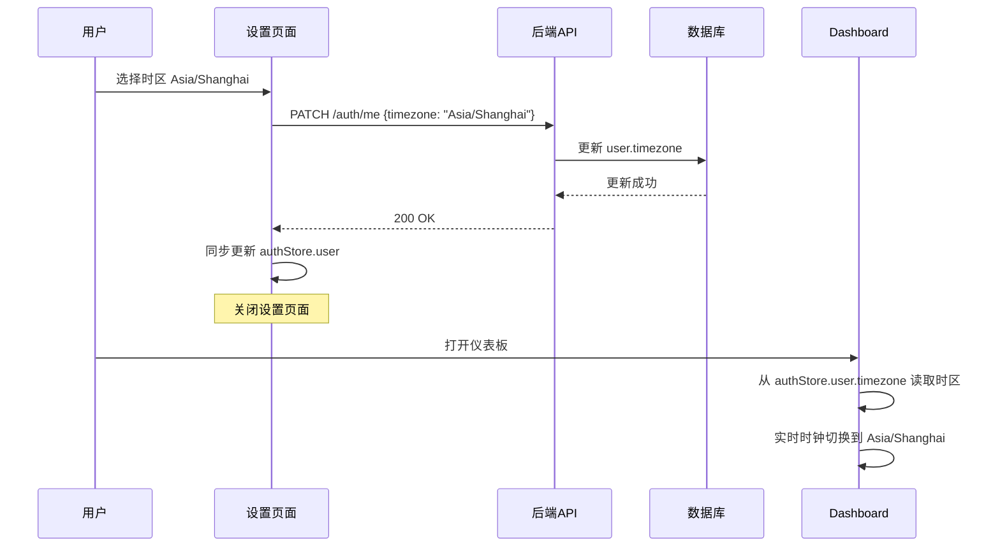

## 12. DX Cluster 实时 Spot 架构

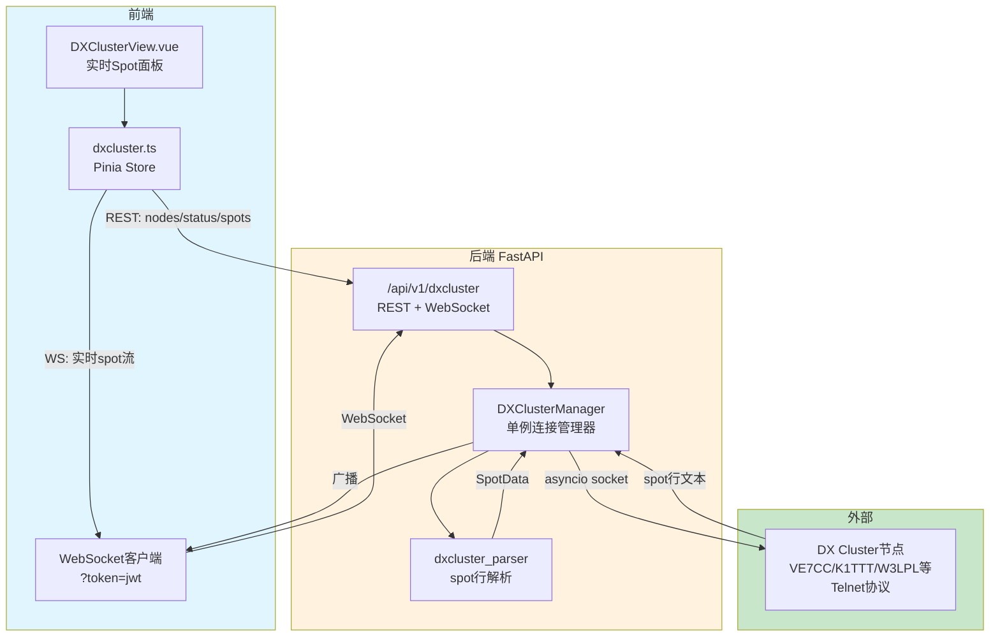

### DX Cluster 连接流程

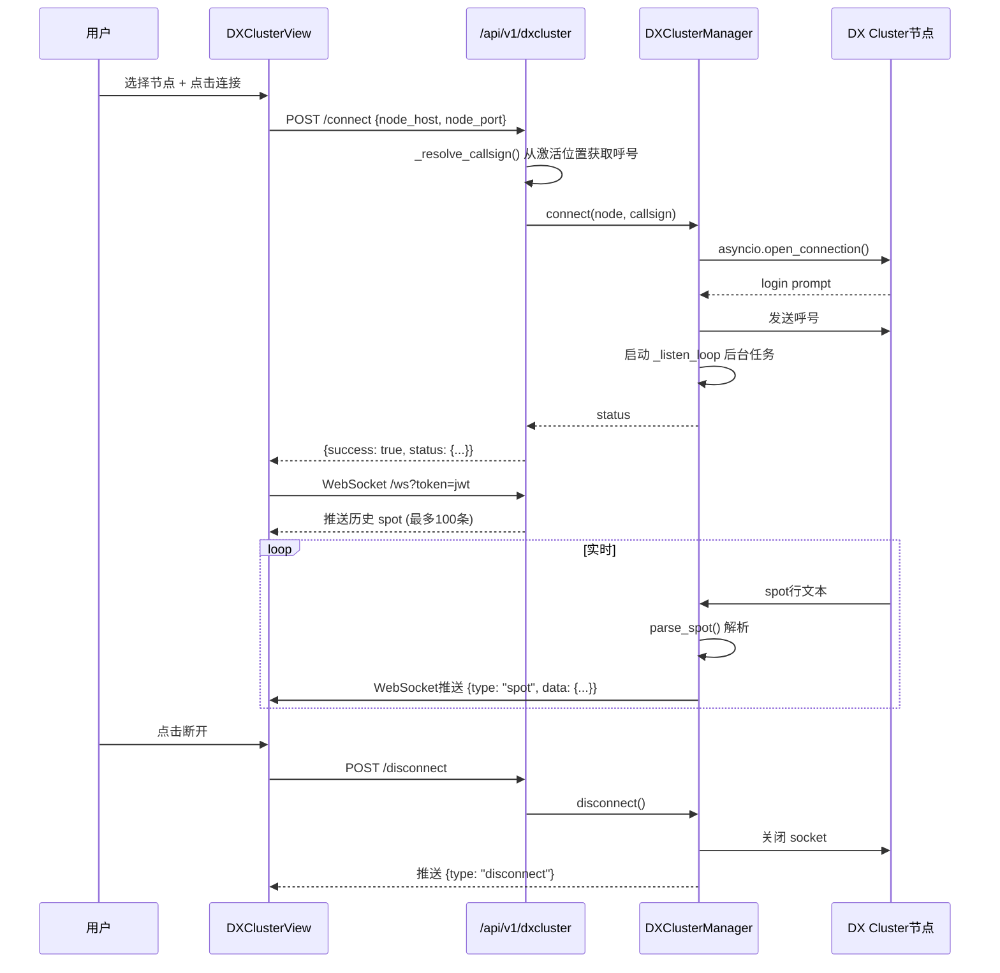

## 13. 回收站流程

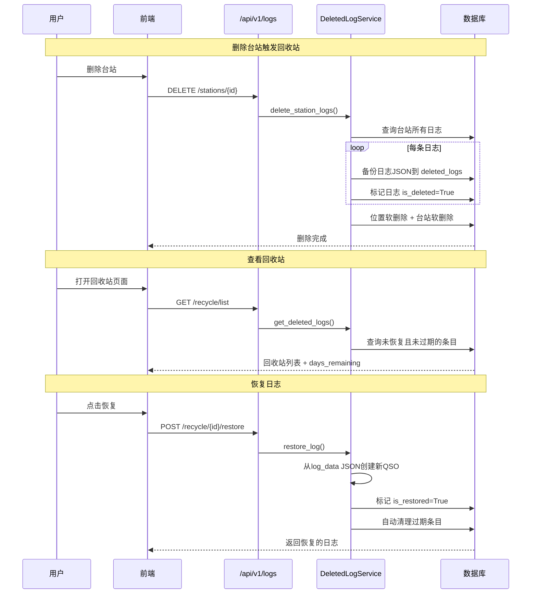

## 14. 文字版架构图

```
┌─────────────────────────────────────────────────────────────────────┐
│                        用户 / 浏览器 / Electron                      │
└──────────────────────────────┬──────────────────────────────────────┘
                               │ HTTP / WebSocket
┌──────────────────────────────▼──────────────────────────────────────┐
│                         Nginx 反向代理                               │
│                    (生产模式: 80/443 + SSL)                          │
│                    (本地模式: Vite Dev Proxy)                        │
└──────────────┬───────────────────────────────────┬──────────────────┘
               │ /api                              │ /
               ▼                                   ▼
┌──────────────────────────┐       ┌──────────────────────────────────┐
│     FastAPI 后端 (8000)   │       │       Vue3 前端 (静态资源)        │
│                          │       │                                  │
│  ┌────────────────────┐  │       │  ┌──────────┐  ┌──────────────┐ │
│  │   中间件层          │  │       │  │ Router   │  │ Pinia Store  │ │
│  │  · JWT 认证         │  │       │  │ 16条路由  │  │ 5个状态模块   │ │
│  │  · 请求日志         │  │       │  └──────────┘  └──────────────┘ │
│  │  · 错误处理         │  │       │  ┌──────────┐  ┌──────────────┐ │
│  │  · CORS            │  │       │  │ Views    │  │ API 层       │ │
│  └────────────────────┘  │       │  │ 16个页面  │  │ Axios+拦截器  │ │
│                          │       │  └──────────┘  └──────────────┘ │
│  ┌────────────────────┐  │       │  ┌────────────────────────────┐ │
│  │   路由层 (12模块)    │  │       │  │ i18n: zh-CN / en-US        │ │
│  │  auth / logs        │  │       │  └────────────────────────────┘ │
│  │  stations / stats   │  │       └──────────────────────────────────┘
│  │  admin / dxcluster  │  │
│  │  map / callsigns    │  │
│  └────────┬───────────┘  │
│           │              │
│  ┌────────▼───────────┐  │       ┌──────────────────────────────────┐
│  │   服务层 (13个)     │  │       │         外部服务                  │
│  │  LogService         │  │       │  QRZ.com API    GitHub API       │
│  │  StationService     │  │       │  DX Cluster节点 (Telnet)         │
│  │  StatsService       │  │       │  SMTP (预留)                     │
│  │  AdminService       │  │       └──────────────────────────────────┘
│  │  AuditService       │  │
│  │  SessionService     │  │
│  │  TokenBlacklist     │  │
│  └────────┬───────────┘  │
│           │              │
│  ┌────────▼───────────┐  │       ┌──────────────────────────────────┐
│  │   数据层            │  │       │         缓存层                   │
│  │  12个 SQLAlchemy    │  │       │  SQLite模式: 内存缓存             │
│  │  ORM 模型           │  │       │  MySQL模式: Redis                │
│  └────────┬───────────┘  │       │  · Token 黑名单                  │
│           │              │       │  · 会话追踪                       │
└───────────┼──────────────┘       │  · 呼号/DX缓存                   │
            │                      └──────────────────────────────────┘
            ▼
┌──────────────────────────────────────────┐
│              数据库                       │
│  SQLite (本地)  /  MySQL 8.0 (服务器)     │
│                                          │
│  users ──┬── stations ──┬── locations    │
│          │              │                │
│          └── qso_logs   └── deleted_logs │
│                                          │
│  callsign_cache  statistics              │
│  log_files  sync_history                 │
│  audit_logs  user_sessions               │
│  system_configs                          │
└──────────────────────────────────────────┘
```

## 15. 主要场景数据流图

### 15.1 用户登录 + Token 管理

```
┌────────┐    POST /auth/login     ┌────────┐    查找用户     ┌────────┐
│  前端   │ ──────────────────────→ │  API   │ ──────────────→│  DB    │
│        │  {username, password}    │        │                 │ users  │
│        │                          │        │ ←────────────── │        │
│        │                          │        │    User对象     │        │
│        │                          │        │                 │        │
│        │                          │        │ 验证密码(bcrypt)│        │
│        │                          │        │ 生成JWT(JTI)    │        │
│        │                          │        │                 │        │
│        │  ←───────────────────── │        │ 创建Session     │        │
│        │  {access_token, user}    │        │ ──────────────→│        │
│        │                          │        │  user_sessions  │        │
│        │ 存储token到localStorage  │        │                 │        │
└────────┘                          └────────┘                 └────────┘

┌────────┐    GET /api/v1/logs      ┌────────┐    解码JWT      ┌────────┐
│  前端   │ ──────────────────────→ │  API   │ ──────────────→│ 认证   │
│        │  Authorization: Bearer   │        │  获取JTI        │ 中间件  │
│        │                          │        │                 │        │
│        │                          │        │ 检查黑名单      │        │
│        │                          │        │ (MySQL模式)     │        │
│        │                          │        │                 │        │
│        │                          │        │ 更新Session     │        │
│        │                          │        │ last_active     │        │
└────────┘                          └────────┘                 └────────┘
```

### 15.2 QSO 日志 CRUD + 回收站

```
创建日志:
┌────────┐  POST /logs  ┌────────┐  自动填充  ┌──────────────┐  INSERT  ┌────────┐
│  前端   │ ──────────→ │  API   │ ─────────→│  LogService   │ ──────→│  DB    │
│        │ {call_sign,  │        │  dxcc     │              │         │qso_logs│
│        │  band, mode} │        │  distance │  从激活位置   │         │        │
└────────┘              └────────┘  grid     │  自动补全字段  │         └────────┘
                                             └──────────────┘

删除日志(回收站):
┌────────┐ DELETE /logs ┌────────┐  备份JSON  ┌──────────────┐  INSERT  ┌────────┐
│  前端   │ ──────────→ │  API   │ ─────────→│DeletedLogSvc │ ──────→│deleted │
│        │              │        │            │              │         │_logs   │
│        │              │        │  软删除    │              │  UPDATE │        │
│        │              │        │ ─────────→│              │ ──────→│qso_logs│
│        │              │        │            │              │  7天过期│is_del=1│
└────────┘              └────────┘            └──────────────┘         └────────┘

恢复日志:
┌────────┐ POST /recycle ┌────────┐  读取JSON  ┌──────────────┐  INSERT  ┌────────┐
│  前端   │ ───────────→ │  API   │ ─────────→│DeletedLogSvc │ ──────→│qso_logs│
│        │ /restore      │        │            │  重建QSO记录  │         │(新记录)│
│        │               │        │  标记已恢复 │              │  UPDATE │        │
│        │               │        │ ─────────→│              │ ──────→│deleted │
└────────┘               └────────┘            └──────────────┘         │_logs   │
                                                                        └────────┘
```

### 15.3 ADI 文件导入

```
┌────────┐  选择.adi文件  ┌────────┐  解析ADI格式  ┌──────────────┐
│  前端   │ ─────────────→│  API   │ ────────────→│ImportExport  │
│        │  multipart     │        │               │Service       │
│        │                │        │               │              │
│        │                │        │  逐条处理     │  for each:   │
│        │                │        │ ←────────────│  · 解析字段   │
│        │                │        │               │  · 验证必填   │
│        │                │        │               │  · 检查重复   │
│        │                │        │               │  · 填充dxcc   │
│        │                │        │               │  · 批量提交   │
│        │                │        │               │  (每500条)    │
│        │                │        │               │              │
│        │  ←────────────│        │               │  记录文件追踪  │
│        │  {imported: N} │        │               │  log_files    │
└────────┘                └────────┘               └──────────────┘
```

### 15.4 数据分析 (DXCC Chart + 统计)

```
┌────────┐  GET /stats/   ┌────────┐              ┌──────────────┐
│Analysis│  dxcc-chart    │  API   │  SQL聚合查询  │StatsService  │
│View    │ ─────────────→│        │ ────────────→│              │
│        │                │        │               │  SELECT      │
│        │                │        │               │  dxcc, band, │
│        │                │        │               │  COUNT, MAX  │
│        │                │        │               │  GROUP BY    │
│        │                │        │               │              │
│        │  ←────────────│        │ ←────────────│  构建矩阵:    │
│        │  {bands,       │        │               │  entity×band │
│        │   entities,    │        │               │  confirmed/  │
│        │   band_conf,   │        │               │  worked      │
│        │   band_worked} │        │               └──────────────┘
│        │                │        │
│        │  渲染DXCC表格   │        │
│        │  340实体×11波段 │        │
│        │                │        │
│        │  点击格子       │        │
│        │ ─────────────→│        │  跳转Logs页
│        │  query: {dxcc, │        │  同时筛选
│        │          band} │        │  DXCC+波段
└────────┘                └────────┘
```

### 15.5 服务器模式: Admin 管理

```
┌────────┐  /admin/users  ┌────────┐  get_current_admin  ┌──────────┐
│ Admin  │ ─────────────→│  API   │ ──────────────────→│ 权限检查  │
│ 前端   │               │        │  role=='admin'?     │          │
│        │               │        │  is_active?         │ SQLite:  │
│        │               │        │                     │ 跳过检查  │
│        │               │        │                     │ MySQL:   │
│        │               │        │                     │ 严格校验  │
│        │               │        │ ←────────────────── │          │
│        │               │        │                     └──────────┘
│        │               │        │
│        │               │        │  AdminService.get_users()
│        │               │        │ ──────────────→ DB (users)
│        │               │        │ ←────────────── 分页结果
│        │               │        │
│        │  ←────────────│        │  AuditService.log()
│        │  {items,      │        │ ──────────────→ DB (audit_logs)
│        │   total}      │        │
└────────┘               └────────┘

操作审计链路:
  登录/注册 ──→ audit_logs: LOGIN / REGISTER
  导入日志   ──→ audit_logs: IMPORT_LOGS
  删除日志   ──→ audit_logs: DELETE_LOGS
  修改密码   ──→ audit_logs: CHANGE_PASSWORD
  管理员操作 ──→ audit_logs: ADMIN_TOGGLE_USER / ADMIN_RESET_PASSWORD / ...
  注销账号   ──→ audit_logs: DELETE_ACCOUNT_REQUEST / CANCEL / CONFIRM
```
