# 系统架构图文档

## 1. 整体系统架构

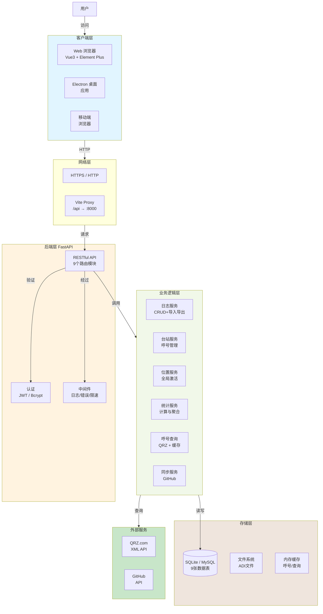

## 2. 三层部署架构

### 2.1 纯本地部署（SQLite）

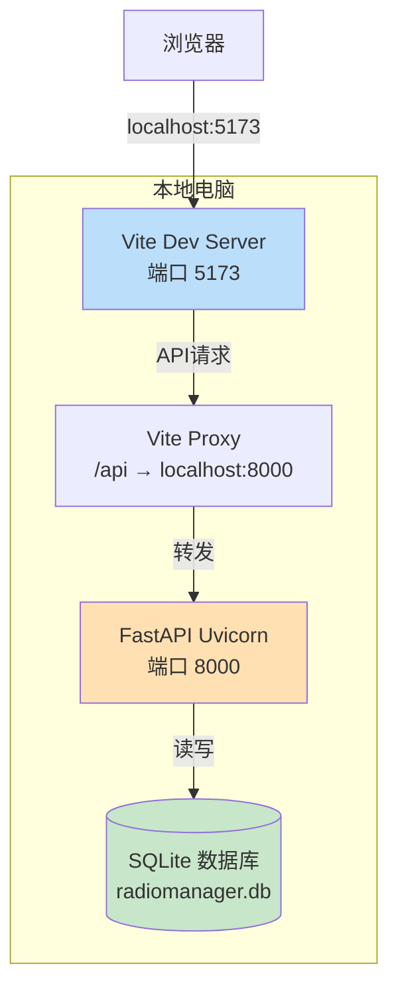

### 2.2 局域网部署（Docker + MySQL）

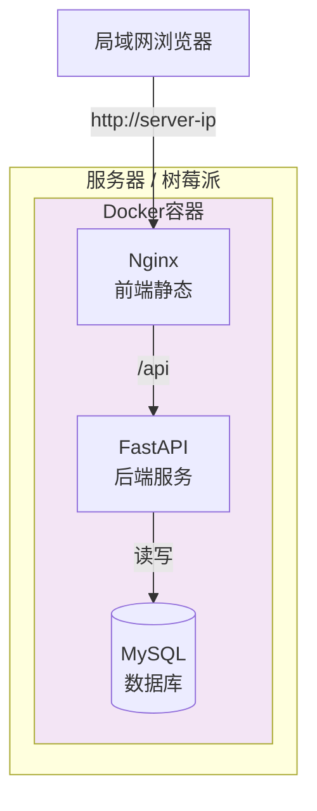

### 2.3 云服务器部署

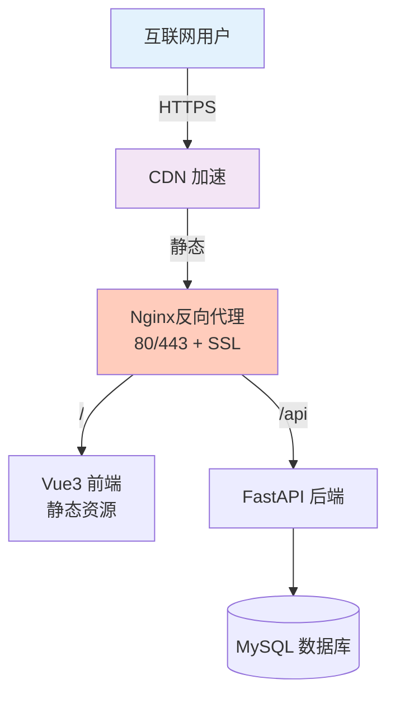

## 3. 前端架构

```mermaid
graph TB
    subgraph Frontend["Vue3 + TypeScript"]
        UI["视图层<br/>10个页面"]
        Store["状态管理层<br/>Pinia"]
        API["API层<br/>Axios + 10模块"]
        Router["路由层<br/>Vue Router"]
        Locale["国际化<br/>zh-CN/en-US"]
    end

    UI -->|调用| Store
    Store -->|请求| API
    API -->|HTTP| Backend
    UI -->|导航| Router
    UI -->|翻译| Locale

    style Frontend fill:#e1f5ff
[root]
```

## 4. 后端架构

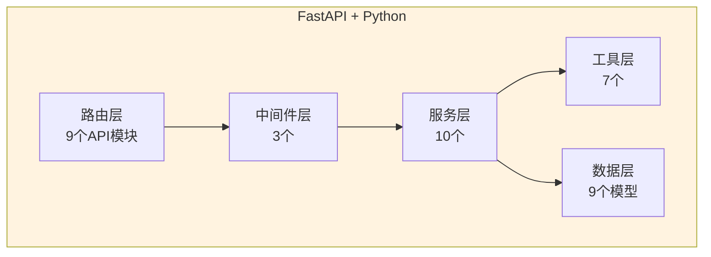

## 5. 数据库架构

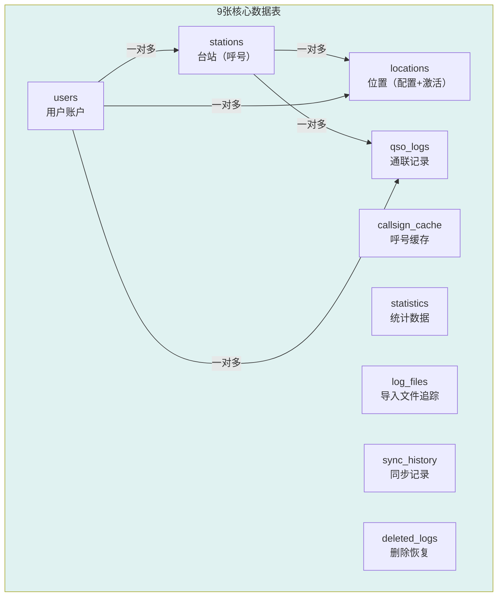

## 6. 台站-位置-日志关系

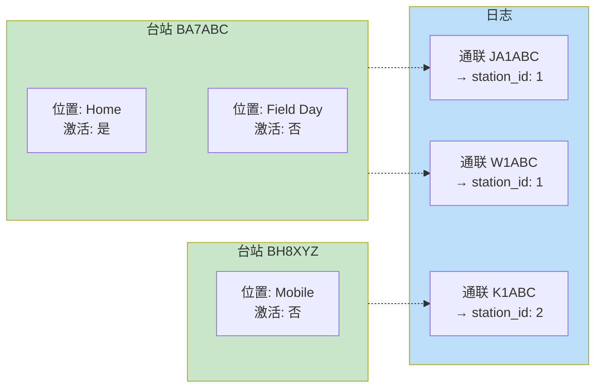

## 7. 位置激活流程

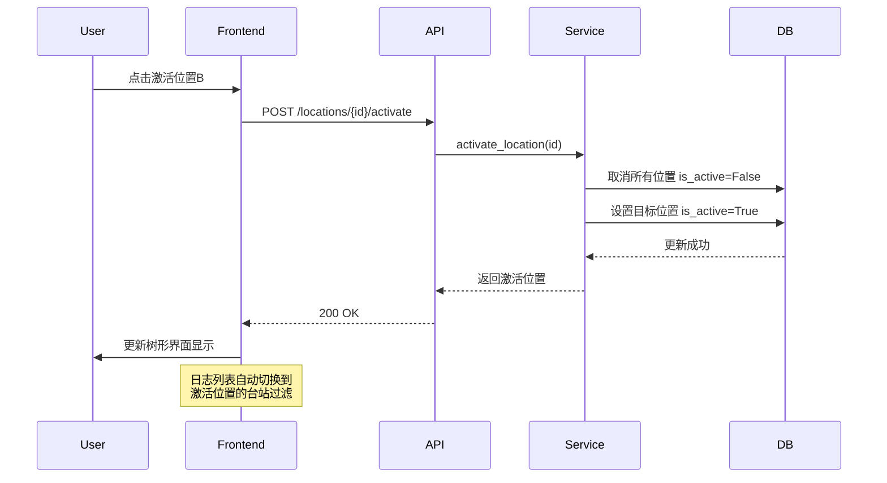

## 8. 日志导入导出流程

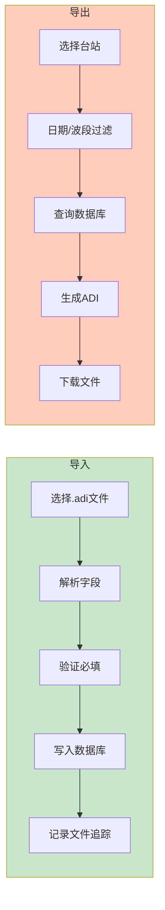

## 9. 认证授权流程

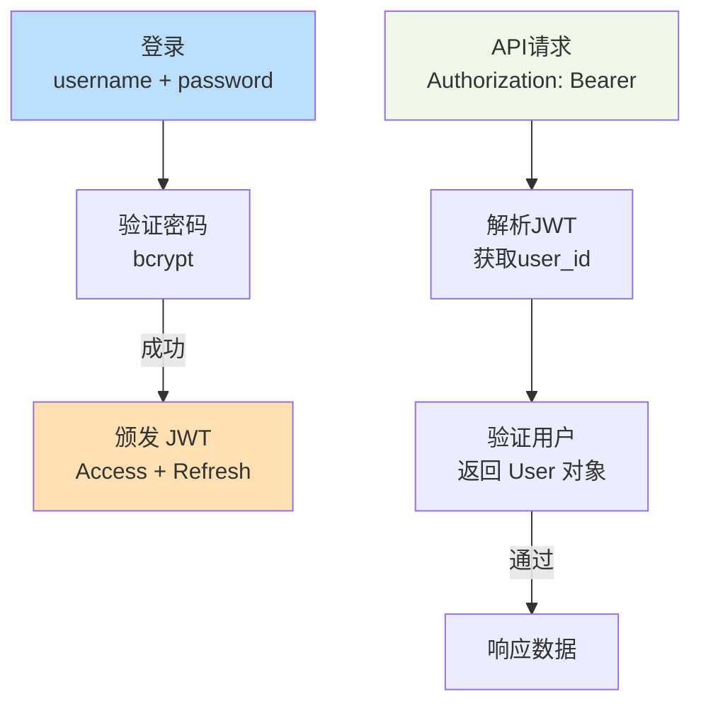

## 10. 仪表板时钟与统计

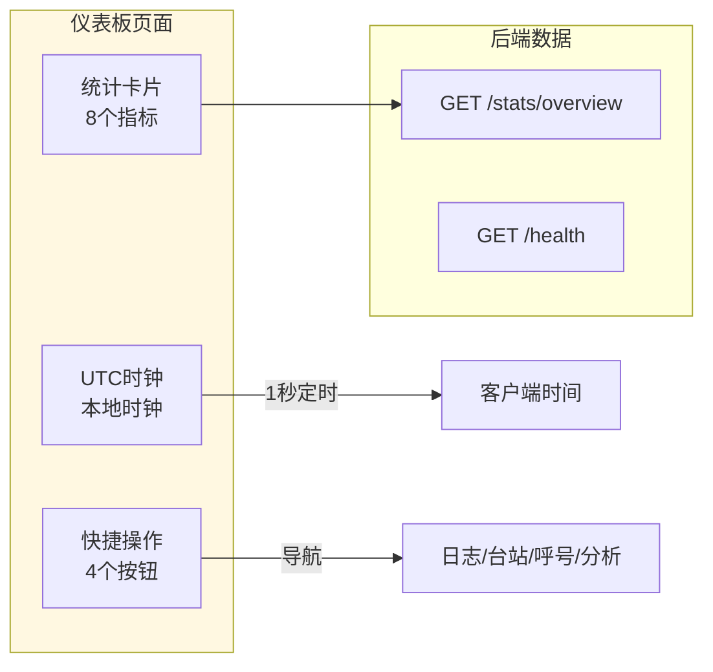

## 11. 时区同步流程

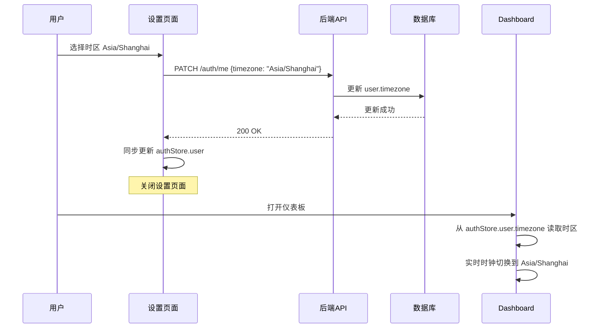
