# 系统架构图文档

## 1. 整体系统架构

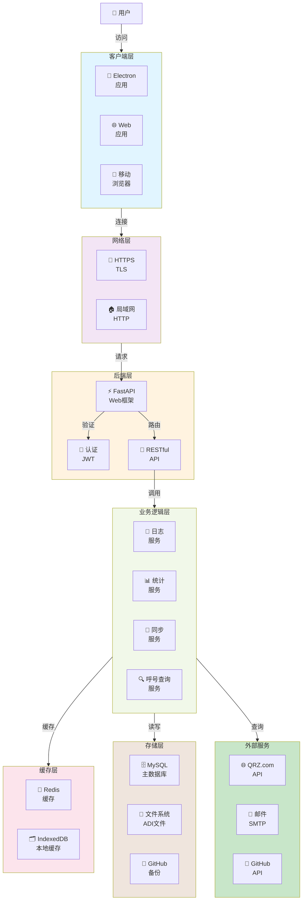

## 2. 三层部署架构对比

### 2.1 纯本地部署架构

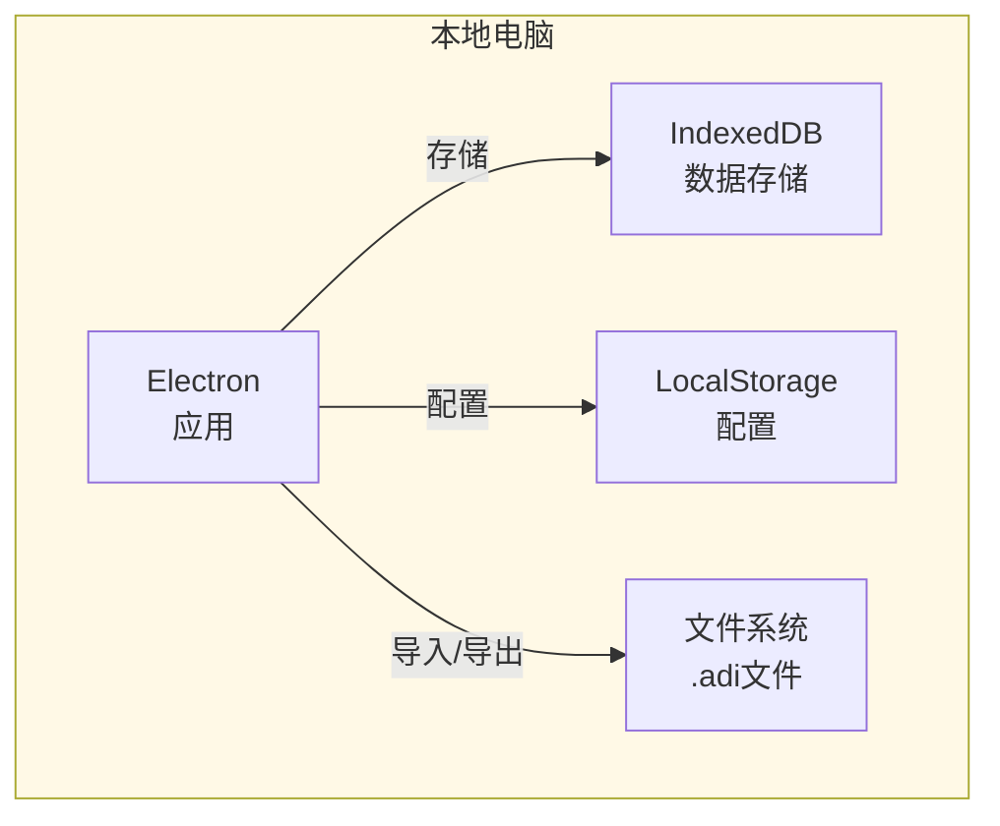

### 2.2 局域网部署架构

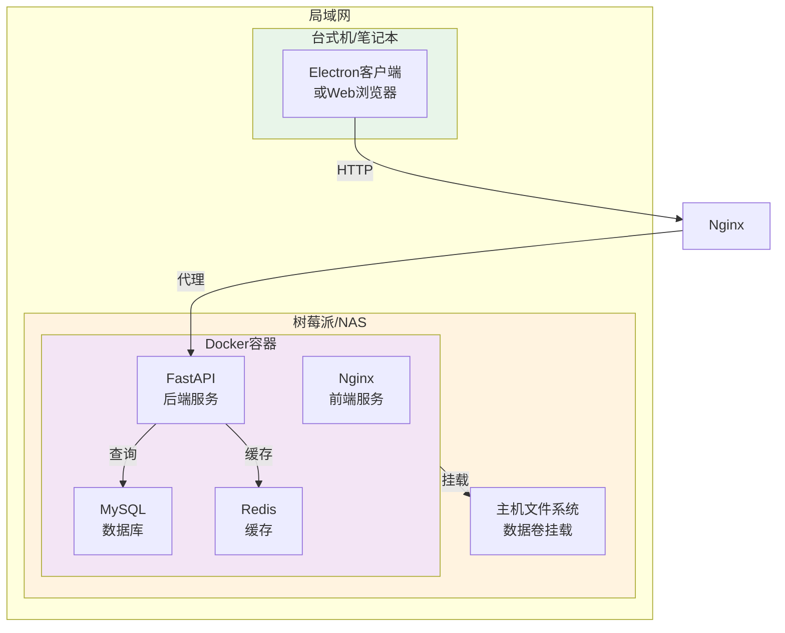

### 2.3 云服务器部署架构

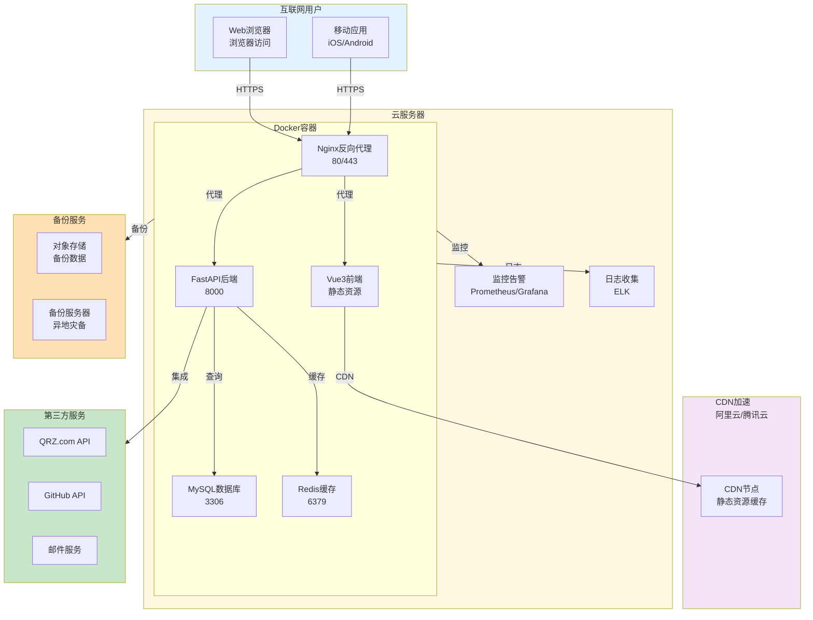

## 3. 前端架构

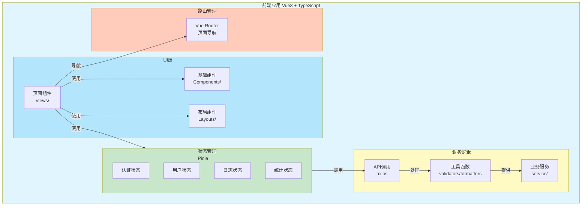

## 4. 后端架构

```mermaid
graph TB
    subgraph Backend["后端服务 FastAPI + Python"]
        subgraph API["API路由层"]
            AuthAPI["auth.py<br/>认证路由"]
            UserAPI["users.py<br/>用户路由"]
            LogAPI["logs.py<br/>日志路由"]
            StatsAPI["stats.py<br/>统计路由"]
            SyncAPI["sync.py<br/>同步路由"]
        end
        
        subgraph Middleware["中间件"]
            Auth["认证中间件<br/>JWT验证"]
            CORS["CORS中间件"]
            ErrorHandler["错误处理"]
            Logger["请求日志"]
        end
        
        subgraph Services["业务服务层"]
            UserService["用户服务"]
            LogService["日志服务"]
            StatsService["统计服务"]
            SyncService["同步服务"]
            QRZService["呼号查询服务"]
        end
        
        subgraph Utils["工具层"]
            Security["安全工具<br/>密码加密"]
            Validators["验证工具"]
            Formatters["格式化工具"]
            ADIParser["ADI解析器"]
            GridUtils["网格工具"]
        end
        
        subgraph Database["数据访问层"]
            SQLAlchemy["SQLAlchemy ORM"]
            Models["数据模型"]
            Schemas["数据Schema"]
        end
    end
    
    API -->|经过| Middleware
    Middleware -->|调用| Services
    Services -->|使用| Utils
    Services -->|访问| Database
    Database -->|映射| Models
    Database -->|验证| Schemas
    
    style Backend fill:#fff3e0
    style API fill:#ffe0b2
    style Middleware fill:#ffb74d
    style Services fill:#f1f8e9
    style Utils fill:#c8e6c9
    style Database fill:#b2dfdb
```

## 5. 数据库架构

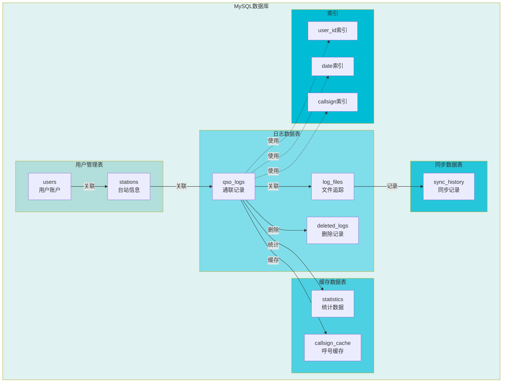

## 6. 数据流架构

### 6.1 日志创建/编辑流程

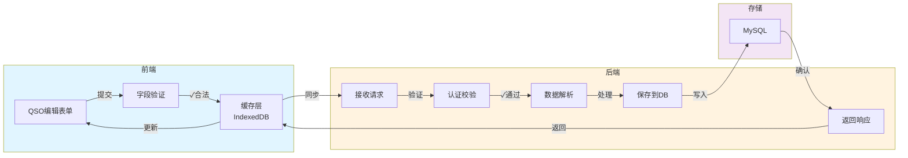

### 6.2 日志导入流程

```mermaid
graph LR
    subgraph Upload["上传阶段"]
        SelectFile["选择ADI文件"]
        Preview["预览内容"]
        Configure["配置导入选项<br/>- 重复检测<br/>- 台站选择"]
    end
    
    subgraph Process["处理阶段"]
        Parse["解析文件"]
        Validate["验证数据"]
        CheckDuplicate["检查重复"]
        Transform["数据转换"]
    end
    
    subgraph Save["保存阶段"]
        BeginTx["开始事务"]
        InsertRecords["插入记录"]
        UpdateStats["更新统计"]
        CommitTx["提交事务"]
    end
    
    subgraph Result["结果阶段"]
        Report["生成报告<br/>- 导入数: 150<br/>- 跳过数: 5<br/>- 错误: 2"]
        SaveLog["记录导入历史"]
    end
    
    SelectFile -->|上传| Preview
    Preview -->|确认| Configure
    Configure -->|开始| Parse
    Parse -->|验证| Validate
    Validate -->|检查| CheckDuplicate
    CheckDuplicate -->|转换| Transform
    Transform -->|事务| BeginTx
    BeginTx -->|插入| InsertRecords
    InsertRecords -->|更新| UpdateStats
    UpdateStats -->|提交| CommitTx
    CommitTx -->|生成| Report
    Report -->|记录| SaveLog
    
    style Upload fill:#c8e6c9
    style Process fill:#ffecb3
    style Save fill:#ffccbc
    style Result fill:#b2dfdb
```

## 7. 认证和授权架构

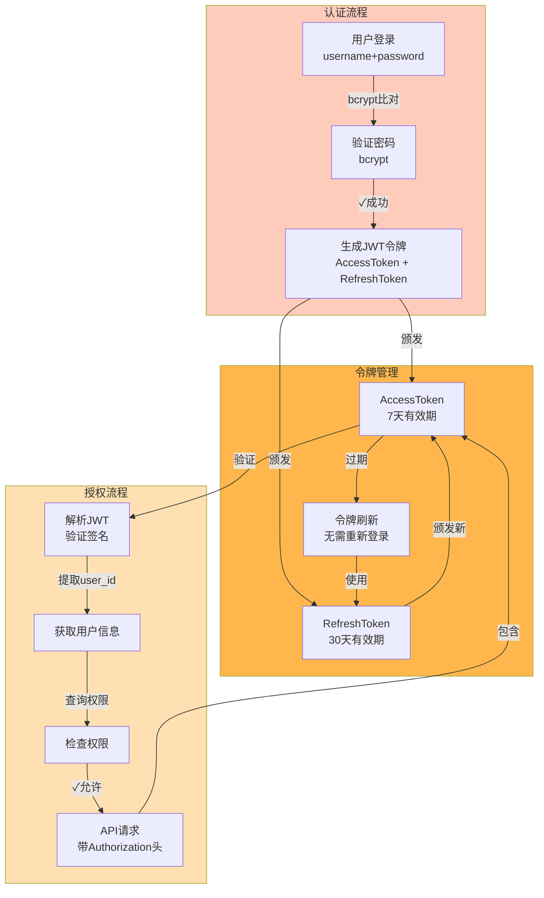

## 8. 缓存策略架构

```mermaid
graph TB
    subgraph CacheLayer["缓存分层"]
        subgraph L1["L1: 浏览器缓存"]
            Cookies["Cookies<br/>session"]
            LocalStorage["LocalStorage<br/>用户偏好"]
            HTTPCache["HTTP缓存<br/>静态资源"]
        end
        
        subgraph L2["L2: 应用缓存<br/>Pinia Store"]
            UIState["UI状态"]
            UserData["用户数据"]
            ListData["列表数据"]
        end
        
        subgraph L3["L3: 本地存储<br/>IndexedDB"]
            LogCache["日志缓存<br/>离线使用"]
            TempData["临时数据<br/>未保存"]
        end
        
        subgraph L4["L4: 服务器缓存<br/>Redis"]
            SessionCache["会话缓存"]
            QueryCache["查询结果"]
            CallsignCache["呼号缓存"]
        end
        
        subgraph L5["L5: 数据库"]
            Database["MySQL<br/>持久化存储"]
        end
    end
    
    L1 -->|命中| L2
    L2 -->|命中| L3
    L3 -->|命中| L4
    L4 -->|命中| L5
    
    style CacheLayer fill:#f5f5f5
    style L1 fill:#ffccbc
    style L2 fill:#ffe0b2
    style L3 fill:#ffb74d
    style L4 fill:#fff176
    style L5 fill:#c5e1a5
```

## 9. 同步和备份架构

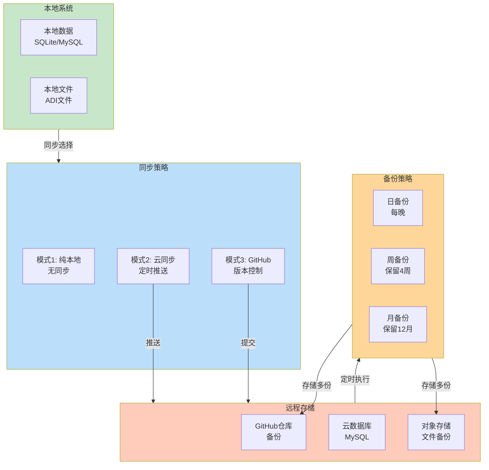

## 10. 扩展性架构

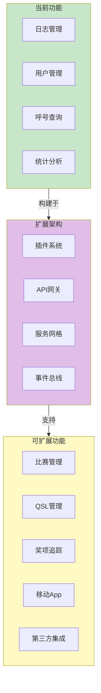

这些架构图展示了RadioManager系统从客户端到服务器的完整设计，包括不同部署模式、数据流、缓存策略和扩展可能性。
